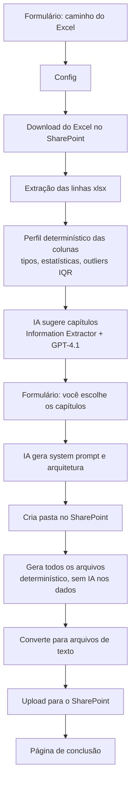

# Excel → Markdown RAG (SharePoint + OpenAI)

Workflow n8n que transforma uma planilha Excel armazenada no SharePoint em uma
base de conhecimento em Markdown pronta para alimentar um agente de IA (RAG)
com alta acurácia. O fluxo baixa o arquivo, interpreta as colunas com IA,
pergunta a você quais capítulos gerar e cria todos os arquivos de forma
**determinística** (os dados nunca passam pela IA), salvando tudo numa pasta
nova no mesmo SharePoint.

## Arquivos gerados

| Arquivo | Papel na base RAG |
| --- | --- |
| `00-system-prompt.md` | System prompt do agente, com protocolo de busca obrigatório |
| `01-arquitetura-do-agente.md` | Arquitetura da solução com diagrama mermaid e inventário RAG em JSON |
| `02-sumario-busca.md` | **Índice de busca**: mapeia cada termo/grupo → arquivo → seção. O agente consulta este arquivo antes de qualquer resposta |
| `capitulo-<id>.md` | Um por capítulo escolhido: dados agrupados, agregados (soma/média/mín/máx) e tabelas |
| `capitulo-outliers.md` | Valores fora da faixa IQR, com a linha original do Excel |
| `dados-rag.json` | Chunks com metadados (`search_index` + `chunks`) prontos para embedding em banco vetorial |
| `gerador_capitulos.py` | Script Python (pandas) auditável que reproduz os mesmos cálculos |

### Por que a acurácia é alta

- A IA **nunca vê as linhas da planilha** — só um perfil estatístico. Todos os
  números nos arquivos vêm de código determinístico (JavaScript no workflow,
  reproduzível pelo `gerador_capitulos.py`).
- O `02-sumario-busca.md` dá ao agente um mapa termo → arquivo → seção, e o
  system prompt o obriga a: consultar o sumário primeiro, responder só com o
  conteúdo do capítulo indicado, citar arquivo/seção e recusar o que não
  estiver na base.

## Pré-requisitos

- n8n **1.82+** (nodes Form v2.3 e Microsoft SharePoint).
- Credencial **Microsoft SharePoint OAuth2 API**: requer um app registration
  no Azure (Entra ID) com permissões delegadas de SharePoint
  (`AllSites.Manage` ou superior) e o campo *Subdomain* preenchido com o
  subdomínio do seu tenant (ex.: `minhaempresa` para
  `minhaempresa.sharepoint.com`).
- Credencial **OpenAI API** (o workflow usa `gpt-4.1` com temperatura 0).

## Importação e configuração (uma vez só)

1. No n8n: **Workflows → ⋯ → Import from File** e selecione `workflow.json`.
2. Selecione as credenciais nos 4 nodes que precisam delas:
   - `Download Excel from SharePoint` e `Upload to SharePoint` → credencial SharePoint;
   - `Create Output Folder` (HTTP Request) → a **mesma** credencial SharePoint;
   - `OpenAI Chat Model` → credencial OpenAI.
3. Nos nodes `Download Excel from SharePoint` e `Upload to SharePoint`, abra o
   campo **Site** e escolha o seu site do SharePoint na lista (uma vez em cada).
4. No node `Config`, troque `https://SEUTENANT.sharepoint.com` pela URL real
   do seu tenant.
5. **Ative** o workflow e copie a URL de produção do formulário (node
   `On form submission`).

## Uso

1. Abra a URL do formulário e informe o caminho do Excel **relativo à
   biblioteca "Documentos"** do site (ex.: `General/dados/vendas.xlsx`).
   Opcionalmente descreva o contexto do agente.
2. Aguarde alguns segundos: o navegador é redirecionado automaticamente para o
   segundo formulário, com os capítulos sugeridos pela IA como checkboxes
   (inclui sempre a opção de capítulo de outliers). Marque os desejados.
3. Ao concluir, os arquivos aparecem numa pasta nova
   `agente-rag-<data-hora>` na raiz da biblioteca "Documentos" do site.

## Ajustes opcionais

| O quê | Onde |
| --- | --- |
| Modelo (ex.: `gpt-4o`) e temperatura | node `OpenAI Chat Model` |
| Fator IQR, máximo de grupos/linhas por tabela | constantes no topo do código dos nodes `Profile Columns` e `Build All Files` |
| Quantidade de capítulos sugeridos (4–8) | prompt do node `Suggest Chapters` |
| Executar os cálculos em Python dentro do n8n | nos três Code nodes, mude *Language* para `pythonNative` — requer instância com o task runner de Python habilitado; por padrão o workflow usa JavaScript para funcionar em qualquer instância, e entrega o equivalente Python auditável em `gerador_capitulos.py` |

## Solução de problemas

| Sintoma | Causa provável |
| --- | --- |
| 404 no download | Caminho errado (deve ser relativo à biblioteca "Documentos", sem `/sites/...` na frente) ou arquivo em outra biblioteca |
| Formulário não redireciona para a seleção de capítulos | Workflow não está **ativo** (em execução de teste, acompanhe pelo editor) |
| Erro `PythonDisabledError` | *Language* de um Code node foi trocada para Python numa instância sem runner Python — volte para JavaScript |
| Erro 401/403 no `Create Output Folder` | Credencial SharePoint sem permissão de escrita no site, ou `sharePointHost` no node `Config` diferente do tenant da credencial |
| Resposta da IA truncada / erro de tokens | Planilhas com centenas de colunas geram perfis grandes — reduza `TOP_VALUES` no node `Profile Columns` |
